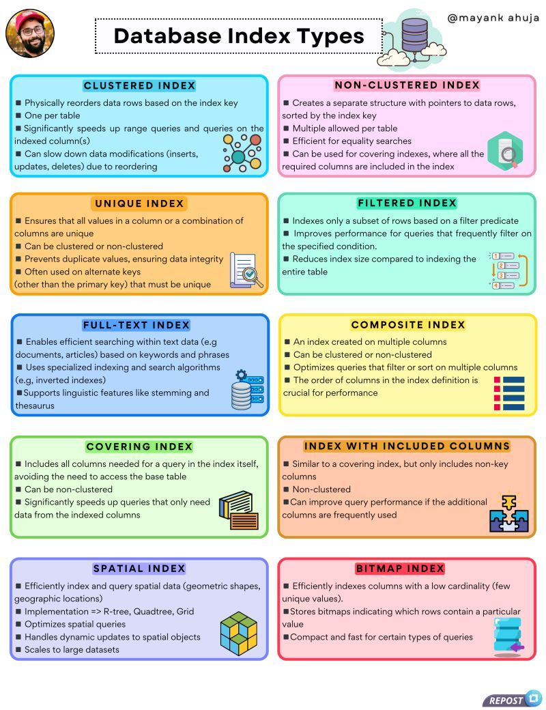
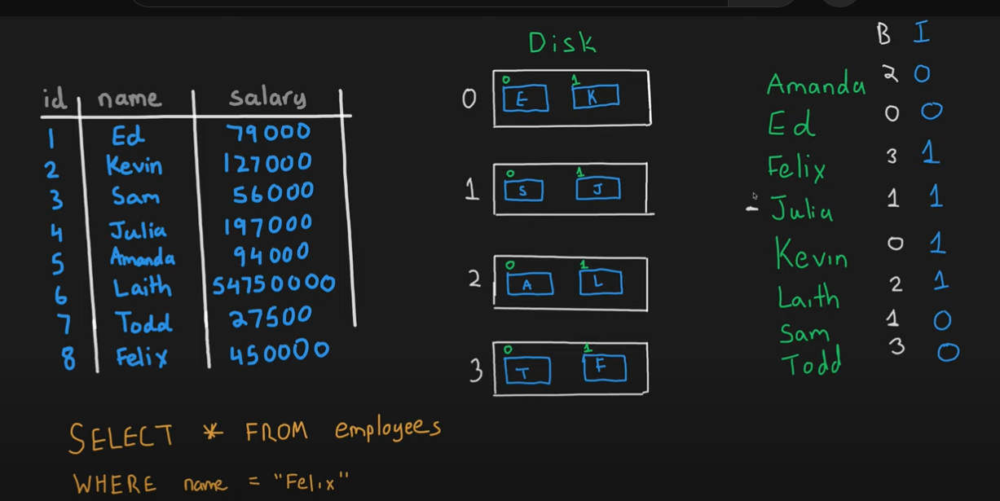

Indexes are used for efficient querying, they are used on Tables as well as Views.

```
CREATE IX_TABLENAME_COLUMN on TableName (Column ASC) - This  is a generic format
```

How Indexes Work : https://www.youtube.com/watch?v=lYh6LrSIDvY

Types of Index

1. Non Clustered (Mostly we create these explicity and used widely)
2. Clustered
3. Unique
4. Filtered
5. XML
6. Full Text
7. Spatial
8. Column Store
9. Index with Included Columns
10. Index on Computed Colums

How Ever, Clustered, Non Clustered and Unqiue are mostly used.



## Clustered and Non Clustered Index
Best Explanation : https://www.youtube.com/watch?v=NGslt99VOCw (Kud Venkat YT)
1. Non Clustered ( Similar to index Page on a Book),
2. Clustered ( Similar to Telephone Directory) and Primary Key Constraint creates Clustered index automatically if no clustered index already exists on the table.

| **Feature**                      | **Clustered Index**                            | **Non-Clustered Index**                                                     |
| -------------------------------- | ---------------------------------------------- | --------------------------------------------------------------------------- |
| **Data Storage**                 | Dictates physical order of data in the table   | Stores only pointers to the data, not the data itself                       |
| **Number of Indexes**            | Only one clustered index per table             | Multiple non-clustered indexes per table                                    |
| **Access**                       | Direct access to data                          | Requires an extra lookup to fetch the actual data                           |
| **Speed**                        | Faster for range queries and sorting           | Faster for specific lookups or filters                                      |
| **Impact on Data Modifications** | Slows down inserts/updates due to reordering   | Slows down inserts/updates due to index maintenance                         |
| **Usage**                        | Columns frequently used in range-based queries | Columns frequently used in exact match lookups                              |
| **Extra Sapce**                  | Not Required                                   | Additional Space is required as these are stored seperately from table data |

### Clustered

- A Clustered Index determines the physical order of data in a table. (Basically they sort the data in Ascending Order by default, but we can created Desc as well). 
- **A Table can only have one Clustered Index, However that Index can be a composite Index**.

```
Composite Clustered Index
CREATE CLUSTERED INDEX IX_TABLENAME_GENDER_SALARY on TABLENAME(GENDER DESC, SALARY ASC)
```

### Non Clustered

The data is stored in one place and the Index in another place. Index will have pointers to the storage location of the data.

- Since the Non Clustered Index is stored seperately from the actual data, a table can have more than one Non Clustered Index.
- In the Indexes they are organized in ASC / DESC order of the Index Key, which doesn't in any way influence the storage of data in the Table.



## Unique and Non Unique Index
- Unique Index is used to enforce Uniqueness of key values in the Index.
- __Uniqueness is a Property of an Index__, and both clustered and non clustered Indexes can be Unique.
- By Default, Primary Key Constraint, creates a Unique Clustered Index.
- By Default, Unique Constraint , creates a Unique Non Clustered Index.
- __There are no Major differences between  unique constraint and unique Index. In fact, when you add a unique constraint, a unique index gets created behind the scenes.__

```
Create Unique NonClustered Index UIX_TABLENAME_FIRST_LASTNAME on EMPLOYEE(FirstName, LastName) 
```